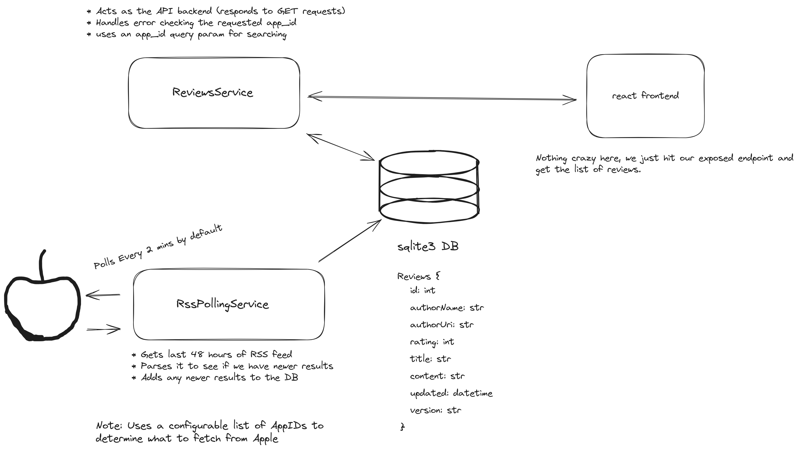

# ReviewsService

Hi! I'm Forrest. This was actually a pretty fun little take-home. It took me about 3.5 hours e2e, and I'm pretty happy with the result. I'm not sure if I'm also including a little bit of a writeup of my process and some of the decisions I made.

## Running all the things

First things first, let's get everything loaded up on your end.

To get the backend started, you just need to run the python script from the root directory of the project. It's a pretty simple script, so it doesn't need any special dependencies. It will run on port 8000 by default.

```bash
cd ./backend
python3 main.py
```

Once you've got that running, you can start the react app similarly. Just `cd` into the web directory, install dependencies, and run.

```bash
cd ./web
npm install
npm run start
```

## The Stack



The backend is composed of two parts. An RssPollingService that polls the Apple RSS feed and stores the results in a sqlite database, and a ReviewsService that acts as the primary API endpoint (i.e. it's exposed for GET requests).

### The RssPollingService

The polling service is pretty straightforward. Look at a list of app ids, fetch the data from apple, do some comparison with the data already in the db, and then save any new reviews.

The service operates by iterating over a list of app IDs (provided at construction), fetching the corresponding data from Apple, comparing this data with the existing data in the database, and saving any new reviews that it finds. This process is repeated at the `polling_interval` to ensure that the database is always up-to-date with the latest reviews.

I went with `sqlite3` for the DB. IMO it's a good stand in for a 'real' database. Python has great support for it in the form of a sqlite3 db, and I figure it's better to show off the fact that I know how to use databases rather than just serializing to a JSON file or something. ;)

### The ReviewsService

The ReviewService is the access point for the backend. It exposes a single endpoint, `/reviews`, which returns a list of reviews for a given app id. I left the parameter parsing fairly extensible in case we wanted to add more filtering options in the future.

I stuck with the request to "not use use any libraries", so I went with python's built-in `http.server` module. That makes the code a bit terse as it requires us to directly deal with the request and doesn't provide any convenience like routing. Definitely not the end of the world, but I did run into some happy CORS edge cases.

### The Frontend

I definitely spent the least time here 😬. I figured it didn't need to be too complicated to meet the requested spec. I did go ahead and add in the ability to click between a pre-defined list of app ids, but I didn't spend too much time on styling.

One note... This is the _one_ place I decided to ignore the 'no-libraries' thing _a little_. I'm way more comfortable with TailwindCSS at the moment, so I decided to go ahead and throw it into the project. It's a small add, and, I figure it doesn't change the implementation details too much.

## The Future

If I were to actually implement something like this for production, I would probably make a few changes. First, I would probably use a more robust database. I'm a big fan of Postgres, but I think any of the big ones would work. I would also probably use a more robust web framework. I'm a big fan of FastAPI, but I think Flask would work just as well. I would also probably add some more filtering options to the ReviewsService. I think it would be cool to be able to filter by date, rating, etc. I would also probably add some more data to the frontend. I think it would be cool to be able to see the average rating for an app, or maybe even a graph of the ratings over time.
